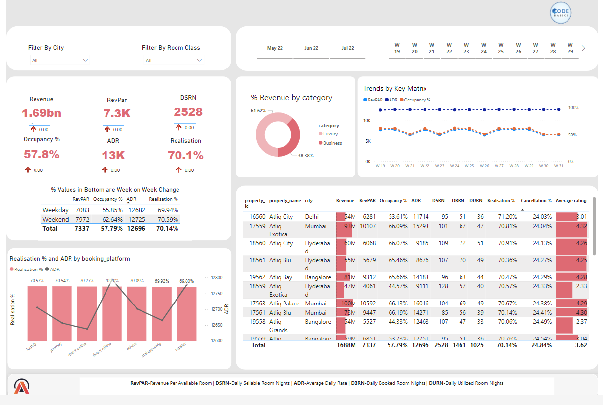

Here’s a sample README for your GitHub repository based on the provided dashboard image:

---

# Revenue Insights Dashboard - Hospitality Domain

## Overview

This project presents a Power BI dashboard designed to provide detailed revenue insights for the hospitality domain. The dashboard consolidates key metrics related to revenue, occupancy, and booking performance across multiple properties, helping stakeholders make data-driven decisions to optimize operations and revenue generation.

## Features

- **Revenue Overview**: Displays total revenue generated (1.69bn) and key metrics such as Revenue Per Available Room (RevPAR), Average Daily Rate (ADR), and Daily Sellable Room Nights (DSRN).
- **Occupancy Insights**: Visualizes overall occupancy percentage (57.8%) and provides a breakdown of performance during weekdays and weekends.
- **Category Breakdown**: Shows the percentage of revenue generated by luxury and business room categories.
- **Performance Trends**: Tracks trends in RevPAR, ADR, and Occupancy rates over time for weekly analysis.
- **Booking Platform Analysis**: Compares realization percentage and ADR by various booking platforms.
- **Property-Level Details**: A detailed table with performance data for each property, including revenue, RevPAR, ADR, occupancy, realization percentage, cancellation rate, and customer rating.

## Key Metrics

- **Revenue**: Total revenue generated across properties.
- **RevPAR (Revenue Per Available Room)**: Measures how well room inventory is being utilized to generate revenue.
- **Occupancy Percentage**: Shows the percentage of occupied rooms relative to total available rooms.
- **ADR (Average Daily Rate)**: Average rate charged per occupied room.
- **DSRN (Daily Sellable Room Nights)**: Total room nights available for booking.
- **Realization Percentage**: Percentage of booked room nights that were actually realized.
- **Cancellation Rate**: Percentage of room bookings that were canceled.
- **Customer Rating**: Average customer rating for each property.

## Data Sources

The dashboard draws data from various sources, including:
- **City-wise and room class-wise revenue data**.
- **Booking platform performance**.
- **Property-level metrics**.

## Tools & Technologies

- **Power BI**: For creating interactive visualizations and detailed reports.
- **DAX**: To optimize calculations and performance metrics.
- **Excel/CSV**: For initial data handling and ETL processes.

## How to Use

1. Open the Power BI file (available in the repository) to explore the dashboard.
2. Use the filters for city and room class to customize the data view.
3. Analyze key metrics such as revenue, RevPAR, and occupancy to make informed business decisions.
4. Review trends and detailed property performance for deeper insights.

## Future Enhancements

- Add more granular filters such as time periods and property types.
- Integrate additional booking platforms for a more comprehensive analysis.
- Incorporate predictive analytics to forecast occupancy and revenue trends.

## Conclusion

This dashboard provides a comprehensive view of revenue insights for the hospitality domain, enabling better operational decisions and highlighting areas of growth and optimization. It offers a clear, data-driven approach to analyzing key performance indicators, trends, and platform efficiencies.

---

This README provides an overview of the project and guides users on how to interact with the dashboard. Let me know if you need more details or adjustments!
